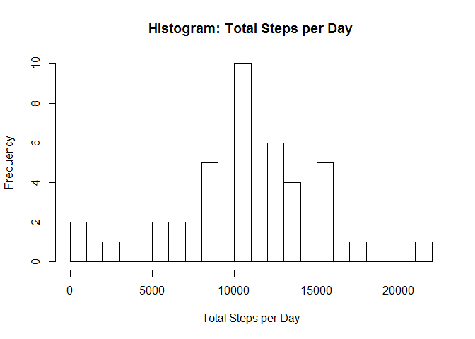
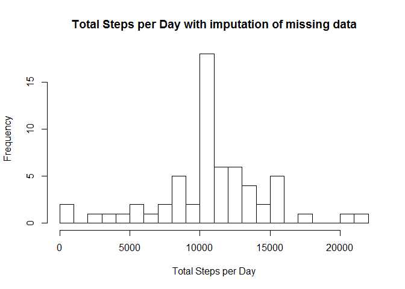
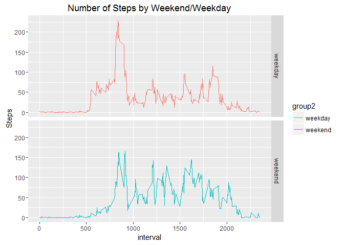

# Reproducible Research: Peer Assessment 1
## Setting Global Options and using relevant libraries
By default, display all R code chunks,using the knitr::opts_chunk option.  
Our data contains a date variable, so let us use the lubridate library.  
Also let us use the Dplyr library since it makes data processing easy.  
The Ggplot2 library will help us graph results.  

```r
knitr::opts_chunk$set(echo=TRUE)
library(lubridate)
```

```
## 
## Attaching package: 'lubridate'
```

```
## The following object is masked from 'package:base':
## 
##     date
```

```r
library(dplyr)
```

```
## 
## Attaching package: 'dplyr'
```

```
## The following objects are masked from 'package:lubridate':
## 
##     intersect, setdiff, union
```

```
## The following objects are masked from 'package:stats':
## 
##     filter, lag
```

```
## The following objects are masked from 'package:base':
## 
##     intersect, setdiff, setequal, union
```

```r
library(ggplot2)
```

## Loading and preprocessing the data
Unzip 'activity.zip' to your working directory.  
Now read data using the read.csv function.

```r
activity=read.csv("activity.csv",header=TRUE, stringsAsFactors = FALSE)
```
You can look at the metadata using str function and peruse the first few observations in the dataset using head function.

```r
str(activity)
```

```
## 'data.frame':	17568 obs. of  3 variables:
##  $ steps   : int  NA NA NA NA NA NA NA NA NA NA ...
##  $ date    : chr  "2012-10-01" "2012-10-01" "2012-10-01" "2012-10-01" ...
##  $ interval: int  0 5 10 15 20 25 30 35 40 45 ...
```

```r
head(activity)
```

```
##   steps       date interval
## 1    NA 2012-10-01        0
## 2    NA 2012-10-01        5
## 3    NA 2012-10-01       10
## 4    NA 2012-10-01       15
## 5    NA 2012-10-01       20
## 6    NA 2012-10-01       25
```

Let us convert date to date format.

```r
activity$date=ymd(activity$date)
str(activity)
```

```
## 'data.frame':	17568 obs. of  3 variables:
##  $ steps   : int  NA NA NA NA NA NA NA NA NA NA ...
##  $ date    : Date, format: "2012-10-01" "2012-10-01" ...
##  $ interval: int  0 5 10 15 20 25 30 35 40 45 ...
```

## What is mean total number of steps taken per day?

This part of the assignment ignore the missing values in the dataset.

1. Calculate the total number of steps taken per day.  

```r
numsteps=activity %>%
  filter(!is.na(steps)) %>%
  group_by(date) %>%
  summarize(totsteps=sum(steps)) %>%
print
```

```
## # A tibble: 53 x 2
##          date totsteps
##        <date>    <int>
## 1  2012-10-02      126
## 2  2012-10-03    11352
## 3  2012-10-04    12116
## 4  2012-10-05    13294
## 5  2012-10-06    15420
## 6  2012-10-07    11015
## 7  2012-10-09    12811
## 8  2012-10-10     9900
## 9  2012-10-11    10304
## 10 2012-10-12    17382
## # ... with 43 more rows
```

2. Make a histogram of the total number of steps taken each day. 

```r
hist(numsteps$totsteps, xlab="Total Steps per Day",main="Histogram: Total Steps per Day", breaks=20)
```

<!-- -->

3. Calculate and report the mean and median of the total number of steps taken per day  
The mean of the total number of steps taken per day is:  

```r
mean(numsteps$totsteps, na.rm = TRUE)
```

```
## [1] 10766.19
```
The meadian of the total number of steps taken per day is:

```r
median(numsteps$totsteps, na.rm = TRUE)
```

```
## [1] 10765
```
## What is the average daily activity pattern?

This part of the assignment ignores the missing values in the dataset.  

1. Calculate the average number of steps taken per interval. 

```r
daily=activity %>%
  filter(!is.na(steps)) %>%
  group_by(interval) %>%
  summarize(steps=mean(steps)) %>%
print
```

```
## # A tibble: 288 x 2
##    interval     steps
##       <int>     <dbl>
## 1         0 1.7169811
## 2         5 0.3396226
## 3        10 0.1320755
## 4        15 0.1509434
## 5        20 0.0754717
## 6        25 2.0943396
## 7        30 0.5283019
## 8        35 0.8679245
## 9        40 0.0000000
## 10       45 1.4716981
## # ... with 278 more rows
```
2.  Plot


```r
g=ggplot(daily,aes(x=interval,y=steps))
g+geom_line()
```

<!-- -->

3.  Find the interval for which there are maximum steps.  

```r
daily[which.max(daily$steps),]
```

```
## # A tibble: 1 x 2
##   interval    steps
##      <int>    <dbl>
## 1      835 206.1698
```

## Imputing missing values


The total number of missing values in the dataset is:  

```r
sum(is.na(activity$steps))
```

```
## [1] 2304
```

1.  Place the missing values in a separate dataset.  

```r
missing=activity %>%
  filter(is.na(steps)) %>%
  select(interval,date)
```
2.  Place the non missing in a separate datasets.  

```r
ok=activity %>%
  filter(!is.na(steps))
```
3.  Fill in the missing by using mean value of steps for each interval.(Daily dataset)

```r
replacemissing=merge(missing,daily, by="interval")
head(replacemissing)
```

```
##   interval       date    steps
## 1        0 2012-10-01 1.716981
## 2        0 2012-11-30 1.716981
## 3        0 2012-11-04 1.716981
## 4        0 2012-11-09 1.716981
## 5        0 2012-11-14 1.716981
## 6        0 2012-11-10 1.716981
```

4.  Create a new dataset that is equal to the original dataset but with the missing data filled in.  

```r
all=rbind(ok,replacemissing)
head(all)
```

```
##   steps       date interval
## 1     0 2012-10-02        0
## 2     0 2012-10-02        5
## 3     0 2012-10-02       10
## 4     0 2012-10-02       15
## 5     0 2012-10-02       20
## 6     0 2012-10-02       25
```

```r
str(all)
```

```
## 'data.frame':	17568 obs. of  3 variables:
##  $ steps   : num  0 0 0 0 0 0 0 0 0 0 ...
##  $ date    : Date, format: "2012-10-02" "2012-10-02" ...
##  $ interval: int  0 5 10 15 20 25 30 35 40 45 ...
```
5.  Compute Total number of steps per day.  

```r
numsteps2=all %>%
  group_by(date) %>%
  summarize(steps=sum(steps)) %>%
print
```

```
## # A tibble: 61 x 2
##          date    steps
##        <date>    <dbl>
## 1  2012-10-01 10766.19
## 2  2012-10-02   126.00
## 3  2012-10-03 11352.00
## 4  2012-10-04 12116.00
## 5  2012-10-05 13294.00
## 6  2012-10-06 15420.00
## 7  2012-10-07 11015.00
## 8  2012-10-08 10766.19
## 9  2012-10-09 12811.00
## 10 2012-10-10  9900.00
## # ... with 51 more rows
```

6.  Make a histogram of the total number of steps taken each day 

```r
hist(numsteps2$steps, xlab="Total Steps per Day",main="Total Steps per Day with imputation of missing data", breaks=20)
```

<!-- -->


6.  Calculate and report the mean and median total number of steps taken per day. 
The mean of the total number of steps taken per day is:  

```r
mean(numsteps2$steps)
```

```
## [1] 10766.19
```
The meadian of the total number of steps taken per day is:

```r
median(numsteps2$steps)
```

```
## [1] 10766.19
```
The effect of the missing value computation is that the mean and median are the same.  

## Are there differences in activity patterns between weekdays and weekends?
1. Break out weekend/weekday.  

```r
all$group=weekdays(all$date)
all$group2=ifelse(all$group=="Sunday" | all$group=="Saturday","weekend","weekday")
all$group2=as.factor(all$group2)
head(all)
```

```
##   steps       date interval   group  group2
## 1     0 2012-10-02        0 Tuesday weekday
## 2     0 2012-10-02        5 Tuesday weekday
## 3     0 2012-10-02       10 Tuesday weekday
## 4     0 2012-10-02       15 Tuesday weekday
## 5     0 2012-10-02       20 Tuesday weekday
## 6     0 2012-10-02       25 Tuesday weekday
```

```r
str(all)
```

```
## 'data.frame':	17568 obs. of  5 variables:
##  $ steps   : num  0 0 0 0 0 0 0 0 0 0 ...
##  $ date    : Date, format: "2012-10-02" "2012-10-02" ...
##  $ interval: int  0 5 10 15 20 25 30 35 40 45 ...
##  $ group   : chr  "Tuesday" "Tuesday" "Tuesday" "Tuesday" ...
##  $ group2  : Factor w/ 2 levels "weekday","weekend": 1 1 1 1 1 1 1 1 1 1 ...
```

2. Calculate the average number of steps taken per interval. 

```r
daily2=all %>%
  group_by(interval,group2) %>%
  summarize(steps=mean(steps)) %>%
print
```

```
## Source: local data frame [576 x 3]
## Groups: interval [?]
## 
##    interval  group2       steps
##       <int>  <fctr>       <dbl>
## 1         0 weekday 2.251153040
## 2         0 weekend 0.214622642
## 3         5 weekday 0.445283019
## 4         5 weekend 0.042452830
## 5        10 weekday 0.173165618
## 6        10 weekend 0.016509434
## 7        15 weekday 0.197903564
## 8        15 weekend 0.018867925
## 9        20 weekday 0.098951782
## 10       20 weekend 0.009433962
## # ... with 566 more rows
```
3.  Make a Panel graph

```r
g <- ggplot(daily2, aes(y=steps, x=interval, color=group2))
g <- g + 
    geom_line(linetype=1) + facet_grid(group2~.)+
    labs(x = "interval") +
    labs(y = "Steps") + 
    labs(title = "Number of Steps by Weekend/Weekday")
print(g)
```

<!-- -->

The person is more active on weekdays earlier in the day.  
This makes sense because most people like to sleep in on the weekends.  
